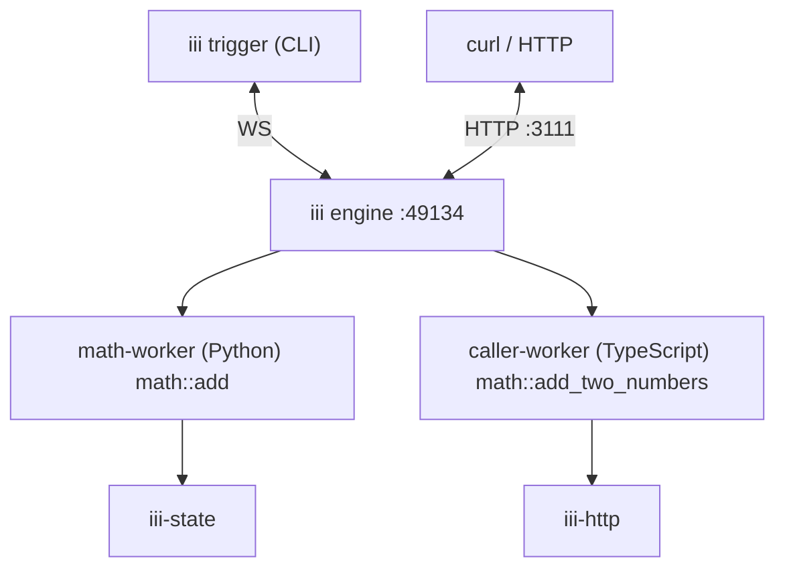

In this tutorial you will learn how iii makes it unreasonably simple to build and extend backend
software.

<Info title="Install iii before proceeding">
  Make sure you have installed iii before proceeding. If you haven't then visit the
  [Install](/0-11-0/install) guide first.
</Info>

## 1. Scaffold the project

```bash
iii create --template quickstart --directory quickstart
cd quickstart
```

This creates the two workers that you'll run: a Python worker that adds two numbers, and a
TypeScript worker that calls the Python worker through the iii engine.

```
quickstart/
  workers/
    math-worker/          # Python
      math_worker.py
    caller-worker/        # TypeScript
      src/worker.ts
```

## 2. Start the engine

```bash
iii --config config.yaml
```

The engine is now listening on `ws://localhost:49134`. Keep this terminal open and open a second
terminal in the `quickstart` directory for the remaining commands.

## 3. Start the Python worker

<Info title="Workers can run anywhere">
  Workers only need a WebSocket connection to the iii engine. They can run locally, in the cloud,
  replicated in kubernetes, or anywhere else.
</Info>

```bash
iii worker add ./workers/math-worker
```

You should see:

```
✓ Worker math-worker added to config.yaml
Path  /Users/tony/iii/projects/testing/quickstart/workers/math-worker
✓ Using cached deps (use --force to reinstall)
✓ math-worker started (pid: 12345)
✓ Worker auto-started
```

This worker registered the function `math::add` with the engine. You could call this function right
now using the command below.

```bash
iii trigger --function-id='math::add' --payload='{"a": 2, "b": 3}'
```

However this is not much different than running an equivalent script on its own. The utility of iii
comes from being able to place any functionality into a worker and then seamlessly compose that
worker with other workers.

<Tip>
  Workers need a moment to install their runtime dependencies after being added. If you see
  `"message": "Function math::add not found"`, wait a few seconds and try again.
</Tip>

## 4. Start the TypeScript worker

```bash
iii worker add ./workers/caller-worker
```

You should see:

```
✓ Worker caller-worker added to config.yaml
Path  /Users/tony/iii/projects/testing/quickstart/workers/caller-worker
✓ Using cached deps (use --force to reinstall)
✓ caller-worker started (pid: 23456)
✓ Worker auto-started
```

This worker registered the function `math::add_two_numbers` with the engine.

## 5. Call across languages

Call the TypeScript worker. It will call the Python worker through the engine and return the result:

```bash
iii trigger --function-id='math::add_two_numbers' --payload='{"a": 10, "b": 20}'
```

```json
{ "c": 30 }
```

## 6. Add state

The `iii worker add` command incrementally adds built-in workers to your running system. Start by
adding the state worker, which gives every function access to a persistent key-value store.

From the folder containing iii's `config.yaml` run:

```bash
iii worker add iii-state
```

Now open `workers/math-worker/math_worker.py` and uncomment the state block so the handler looks
like this:

```python
def add_handler(payload: dict) -> dict:
    a = payload.get("a", 0)
    b = payload.get("b", 0)
    logger.info(f"math::add called in Python with a={a}, b={b}")
    result = {"c": a + b}

    running_total = iii.trigger(
        {
            "function_id": "state::get",
            "payload": {"scope": "math", "key": "running_total"},
        }
    )
    new_total = (running_total or 0) + result["c"]
    iii.trigger(
        {
            "function_id": "state::set",
            "payload": {"scope": "math", "key": "running_total", "value": new_total},
        }
    )
    result["running_total"] = new_total

    return result
```

Save the file and call the function a few times:

```bash
iii trigger --function-id='math::add' --payload='{"a": 2, "b": 3}'
```

```json
{ "c": 5, "running_total": 5 }
```

```bash
iii trigger --function-id='math::add' --payload='{"a": 10, "b": 20}'
```

```json
{ "c": 30, "running_total": 35 }
```

The running total persists across every call — including calls that arrive through
`math::add_two_numbers`.

## 7. Add HTTP endpoints

Now let's add an HTTP worker to expose your functions as REST endpoints.

From the folder containing iii's `config.yaml` run:

```bash
iii worker add iii-http
```

Open `workers/caller-worker/src/worker.ts` and uncomment the HTTP block at the bottom of the file:

```typescript
iii.registerFunction(
  "http::add_two_numbers",
  async (payload: { body: { a: number; b: number } }) => {
    const result = await iii.trigger({
      function_id: "math::add_two_numbers",
      payload: payload.body,
    });
    return {
      status_code: 200,
      body: { c: result.c, running_total: result.running_total },
      headers: { "Content-Type": "application/json" },
    };
  },
);

iii.registerTrigger({
  type: "http",
  function_id: "http::add_two_numbers",
  config: { api_path: "/math/add-two-numbers", http_method: "POST" },
});
```

Save the file, then call the new endpoint with curl:

```bash
curl -X POST http://localhost:3111/math/add-two-numbers \
  -H 'Content-Type: application/json' \
  -d '{"a": 100, "b": 200}'
```

```json
{ "c": 300, "running_total": 335 }
```

The same functions that respond to `iii trigger` now also respond to HTTP requests with no code
changes to the handlers themselves.

## 8. How it works

### Python worker

`workers/math-worker/math_worker.py`:

```python
import os
from iii import register_worker, InitOptions, Logger

iii = register_worker(
    os.environ.get("III_URL", "ws://localhost:49134"),
    InitOptions(worker_name="math-worker"),
)
logger = Logger()


def add_handler(payload: dict) -> dict:
    a = payload.get("a", 0)
    b = payload.get("b", 0)
    logger.info(f"math::add called in Python with a={a}, b={b}")
    return {"c": a + b}


iii.register_function("math::add", add_handler)
```

`register_worker` connects to the engine over WebSocket. `register_function` makes `math::add`
available to the entire system.

### TypeScript worker

`workers/caller-worker/src/worker.ts`:

```typescript
import { registerWorker, Logger } from "iii-sdk";

const iii = registerWorker(process.env.III_URL ?? "ws://localhost:49134");
const logger = new Logger();

iii.registerFunction("math::add_two_numbers", async (payload: { a: number; b: number }) => {
  logger.info("math::add_two_numbers called in TypeScript", payload);

  const result = await iii.trigger({
    function_id: "math::add",
    payload,
  });

  return result;
});
```

`registerWorker` connects to the engine the same way the Python worker does. The `iii.trigger()`
call inside the handler invokes `math::add` on the Python worker through the engine. The TypeScript
worker doesn't need to know where the `math::add` function is running, its language, or anything
else.

### Worker manifest

Each worker has an `iii.worker.yaml` that describes how to run the worker. Here is the Python
worker's manifest. While these workers are started with the `iii worker add` command they do not
need to be running alongside the iii instance. These workers can run anywhere and even be
replicated. Every worker simply connects to iii over WebSocket. iii then handles all routing.

```yaml
name: math-worker
runtime:
  kind: python
  package_manager: pip
  entry: math_worker.py
scripts:
  install: "pip install -r requirements.txt"
  start: "python math_worker.py"
```

`name` identifies the worker. `runtime` tells the engine the language and entrypoint. `scripts`
define how to install dependencies and start the worker.

### Architecture



## 9. Explore with the iii Console (Optional)

iii contains an interactive web interface to help observe a iii system end to end. It's particularly
useful for debugging.

The console can be started in a new terminal:

```bash
iii console
```

Open your browser to [http://localhost:3113/](http://localhost:3113/) to see workers, functions,
triggers, queues, logs, traces, and runtime state for the running system. The console opens on the
Workers page by default.

<Tip>
  See the full [Console documentation](/0-11-0/console) for details on invoking functions,
  inspecting traces, viewing state, and more.
</Tip>

## 10. Add Agent Skills (Optional)

Give your IDEs and AI coding agents full context on iii:

```bash
npx skills add iii-hq/iii/skills
```

## Next Steps

You scaffolded a project, started two workers in different languages, called functions across them,
added persistent state, and exposed everything over HTTP — all by incrementally adding workers to a
running system.

<CardGroup cols={2}>
  <Card
    title="How to use Functions & Triggers"
    href="/0-11-0/how-to/use-functions-and-triggers"
    icon="book-open"
  >
    Learn how to register functions, trigger them, and bind them to events.
  </Card>
  <Card
    title="Concepts"
    href="/0-11-0/primitives-and-concepts/functions-triggers-workers"
    icon="table-layout"
  >
    Understand Functions, Triggers, and Workers from a conceptual point of view.
  </Card>
</CardGroup>
