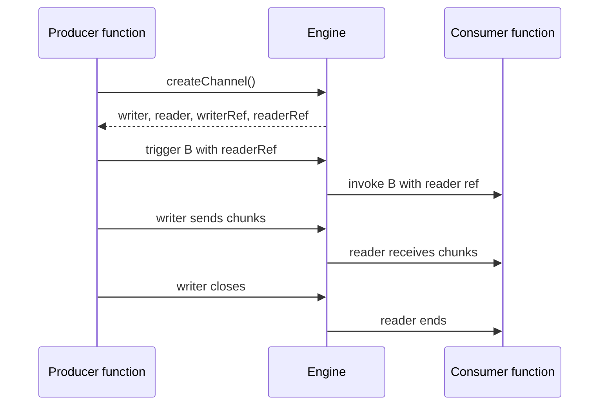

<!-- generated by iii-skill-render. DO NOT EDIT (changes here are overwritten on the next render). Edit docs/understanding-iii/channels.mdx. -->

# Channels

## What channels are

Channels are stream pipes between iii workers. They let one function write bytes while another
function reads those bytes in real time, even when the functions run in different processes or
languages.

## The model

| Concept | What it does                                                    |
| ------- | --------------------------------------------------------------- |
| Channel | A WebSocket-backed pipe managed by the engine.                  |
| Writer  | Sends bytes or text messages into the pipe.                     |
| Reader  | Receives bytes or text messages from the pipe.                  |
| Ref     | A small serializable token passed through `trigger()` payloads. |

The key idea is that refs travel through regular function calls, but the data itself travels over
the channel.

## Why channels exist

Function invocations are JSON messages. That is perfect for structured events and command payloads,
but it is the wrong approach for large files, media, streaming responses (agents, chats), and
long-running partial output.

Channels split coordination from data transfer:

- A function call coordinates the work.
- A channel carries the stream.
- The engine tracks tracing and routing.

## Runtime flow

The producer creates a channel and passes `readerRef` to the consumer. Node and Python materialize
that ref into a live reader before the handler runs. Rust receives the ref as JSON and constructs a
`ChannelReader` from it. The producer writes chunks into its local writer, and the consumer reads
those chunks from its local reader.

## Backpressure and lifecycle

Channel streams connect lazily. Creating a channel allocates refs, but the WebSocket stream connects
when one side starts reading or writing. Backpressure is handled by the SDK stream implementation so
writers can pause when readers cannot keep up.

When the writer closes, the reader receives the stream end. When a worker disconnects, its channel
connections close with it.

For bidirectional communication, create two channels: one for each direction.
