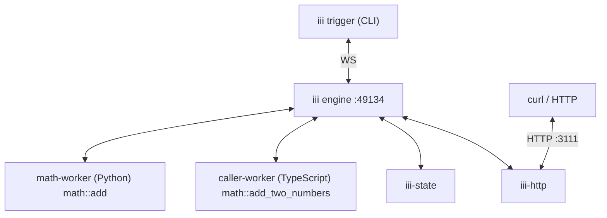

<!-- generated by iii-skill-render. DO NOT EDIT (changes here are overwritten on the next render). Edit docs/understanding-iii/index.mdx. -->

# Workers, Triggers, and Functions

Unix gave processes a single interface. React gave components a single interface. iii gives every
category of software (queues, schedulers, agents, frontends, sandboxes, business logic, etc.) a
single interface: **Workers** host work, **Functions** are the work, **Triggers** are what causes
the work to run, and the **Engine** routes between them. Once you have a mental model for those four
pieces, everything else in iii is a variation on a theme.

<Note>This page uses the [Quickstart tutorial](/quickstart) as an example.</Note>

## The four pieces

This is a brief recap of the four pieces; the sections below expand each one with the Quickstart as
an example. More details about their actual usage are in [Using iii / Workers](/using-iii/workers)
and the rest of the "Using iii" section.

### Worker

A Worker is anything that connects to the Engine and registers Triggers and Functions with it.
Workers can run anywhere (on a laptop, in a container, in a browser tab, on a microVM) and in any
language as long as they can open a WebSocket to the Engine.

### Trigger

A Trigger is what causes a Function to run. A Trigger has a type (HTTP, cron, queue message, state
change, another Function calling `trigger`), a configuration (which path, which schedule, which
queue), and the function ID it invokes.

### Function

A Function is a named handler inside a Worker. It takes a payload and returns a result. Function
identifiers follow a `service::name` convention so they remain stable across worker restarts and
language boundaries.

### Engine

The Engine is the coordinator. It accepts worker connections, maintains a live registry of available
Functions and Triggers, and routes invocations to whichever Worker currently provides the requested
Function.

## The Quickstart

The Quickstart tutorial produces a running system with two Workers connected to the same Engine:

1. `math-worker` is a Python Worker that registers `math::add`.
1. `caller-worker` is a TypeScript Worker that registers `math::add_two_numbers`, which calls
   `math::add` through the Engine.

By the end of the Quickstart, the system also includes the `iii-state` and `iii-http` Workers, an
HTTP Trigger that exposes `math::add_two_numbers` at `POST /math/add-two-numbers`, and a key-value
scope named `math` holding a `running_total`.

The runtime topology looks like this:

Every arrow is a WebSocket connection between a Worker and the Engine. There is no direct
worker-to-worker traffic. When `caller-worker` invokes `math::add`, the call goes through the
Engine, which looks up the current location of `math::add` in its registry and routes the invocation
to `math-worker`.

## Workers

Workers are what actually do things in an iii system. Every category of capability is built as a
Worker: queues, scheduling, sandboxing, observability, agents, business logic, devices, and even
code executing in a browser.

Specifically, a Worker is a process that connects to the Engine over WebSocket and announces a set
of Functions it can run and Triggers to register. Once connected, those Functions are invocable from
anywhere in the system and those Triggers will respond to their events without per-pair integration
code between the caller and the Worker.

The Worker concept is intentionally narrow. A Worker is not a microservice, a job runner, or a
sidecar. It is a participant in the Engine's live registry that contributes Functions and Triggers.
Whether the Worker is a long-lived process serving thousands of invocations per second or a
short-lived process that connects, registers, runs once, and shuts down, the Engine treats it the
same.

### Worker isolation

Workers are intended and designed to be independent processes. One Worker crashing does not affect
others. The Engine connects to each Worker over a separate WebSocket and routes invocations only to
Workers that are currently connected. A crash, restart, or network partition affecting one Worker
does not propagate to the others. The crashed Worker's Functions and Triggers drop out of the
routing table on disconnect, and every other Worker keeps serving.

### In the Quickstart

Both Workers in the Quickstart fulfill the same contract: open a WebSocket connection to the Engine.
Once connected they can register Functions, register Triggers, and `trigger()` other Functions. A
Worker will typically do at least one of these things but ultimately isn't required to do any of
them.

The Python and TypeScript Workers are independent processes in different languages, with different
runtimes, possibly on different machines. Neither one knows the execution context of the other. They
both talk to the Engine, and the Engine handles the rest.

This is what "any language, any runtime" means in practice: the worker contract is small enough to
implement in any language that can use a WebSocket and JSON, and the Engine treats every Worker the
same regardless of how it was built or where it runs.

<Note>
  For the connection lifecycle from worker code, see [Creating Workers /
  Workers](/creating-workers/workers#worker-lifecycle-states).
</Note>

## Triggers

A Trigger is a binding that tells iii when to invoke a Function. The Trigger declares a type (the
kind of event that causes it to fire), a configuration (the per-type details, like an HTTP path or a
cron expression), and the function ID it invokes. When the corresponding event happens, the Trigger
fires and the Engine routes the invocation to a Worker that provides the Function. HTTP requests,
cron schedules, queue messages, state changes, log events, and stream events all become Function
invocations through Triggers.

### Trigger types

<Note>
  `worker.trigger()` and the `iii trigger` CLI command can invoke any registered Function via its
  `function_id` (see [Direct invocation](#direct-invocation) below). The trigger types described
  here are how Functions get bound to other event sources (HTTP requests, cron schedules, queue
  messages, etc.). Workers can define their own trigger types.
</Note>

Trigger types come from connected Workers. A Worker that can source events declares one or more
trigger types alongside their configuration schemas. The iii-http Worker provides the `http` trigger
type. The iii-cron Worker provides the `cron` trigger type. The iii-state Worker provides the
`state` trigger type. A Trigger of a given type can only be registered while a Worker advertising
that type is connected, because that Worker is what produces the events that fire it.

### Trigger components

A Trigger has three parts: a `type` (the kind of event, like `http` or `cron`), a `config` (the
per-type details, like an HTTP path or a cron expression), and a `function_id` (the Function to
invoke). Together they tell iii what event to listen for, how to listen, and what to call when the
event happens.

A Trigger can also specify an optional `condition_function_id` that runs before the handler. When
the Trigger fires, the Engine invokes the condition function with the same payload the handler would
receive. If the condition returns a truthy value, the handler runs; if not, the invocation is
skipped. Since Triggers are concerned with "when to do" and Functions are concerned with "what to
do", conditional functions preserve that separation: the Function stays focused on its work instead
of accumulating per-Trigger guards.

### Trigger pipeline

When a Trigger fires, the Engine looks up its `function_id` in the live registry, finds a Worker
that currently provides the Function, and dispatches the invocation. The function handler sees the
payload alone, never the source of the Trigger or the type of event that fired it.

### Trigger Actions

Function invocation can be controlled via Trigger Actions. The default, synchronous mode blocks
until the Function returns its result or the configured timeout fires. The fire-and-forget mode
(`TriggerAction.Void`) returns immediately, scheduling the Function to run without waiting for a
result. Synchronous invocations are appropriate when the caller needs the value the Function
returns. Fire-and-forget is for side-effect work where the caller does not need to wait.

<Note>
  Workers can also define their own `TriggerAction`s. The iii-queue Worker provides
  `TriggerAction.Enqueue({queue})`, which routes the invocation through a named queue with retries.
  See iii-queue for the queue mechanics.
</Note>

### Trigger lifecycle

Triggers move through four states. `registered` means the Trigger has been declared with the Engine.
`active` means the Trigger is currently listening for its event. `invoked` means an event has fired
the Trigger. `unregistered` means the Trigger has been removed. When the Worker that owns a Trigger
disconnects, all of its Triggers are unregistered automatically along with its Functions.

### In the Quickstart

The Quickstart tutorial invokes Functions with Triggers in three different ways:

1. The CLI `iii trigger math::add a=2 b=3` is a Trigger fired by the CLI itself. The Engine routes
   the invocation to whatever Worker provides `math::add`.
1. The SDK call `worker.trigger({ function_id: 'math::add', ... })` is another version of the same
   idea: one Function inside one Worker firing a Trigger that invokes another Function, routed
   through the Engine just like the CLI version.

   Both paths work against any registered Function without registering an explicit Trigger; every
   `registerFunction()` inherently gets a Trigger that can be invoked with these two methods.

1. The HTTP Trigger added by the `iii-http` Worker is done through `worker.registerTrigger()` and is
   the common reactive way to implement Triggers.

   In this example `iii-http` owns the HTTP socket; when a request arrives at
   `POST /math/add-two-numbers` the following happens:
   1. `iii-http` looks up the matching Trigger and fires a request targeting the `math::add`
      Function.
   1. The Engine receives the request and routes the invocation to `caller-worker`.
   1. Finally the response flows back the same way. The `math::add` Function never sees an HTTP
      request. It sees a payload, like every other call.

One Function can have many Triggers. The same Function could be invoked by a cron schedule, a queue
message, and a direct CLI call.

## Functions

A Function is a named handler inside a Worker. It takes a payload and returns a result. From the iii
system's perspective, a Function is identified by its name and addressable across language and
location boundaries. Callers do not know what Worker is providing the Function, what language the
handler is written in, or where the Worker is running. The Engine routes each invocation to a Worker
that currently provides the target Function.

A Function has no fixed shape beyond payload-in / result-out. Some Functions are pure computation.
Some perform side effects (state writes, HTTP calls, queue enqueues). Some are agentic, invoking
other Functions in turn. The Engine does not distinguish: routing is the same for all of them.

### Function identifiers

Function identifiers use the `service::name` convention. The `service` segment groups related
Functions together as a namespace, scope, or worker name. The `name` segment is the specific
handler. Identifiers like `math::add`, `state::get`, and `http::serve` follow this convention.

The convention is a recommendation, not a hard rule. Any string is a valid function ID at the engine
level, but the `service::name` form makes the Function's intent obvious to readers and avoids
collisions between unrelated Functions registered by different Workers.

{/* TODO: Confirm if we still have restricted string prefixes */}

### Direct invocation

Registering a Function with `registerFunction()` makes it directly invokable through
`worker.trigger()` from any connected Worker and through the `iii trigger` CLI command. No explicit
Trigger registration is required for these two paths; they are the baseline call surface every
registered Function gets. Other trigger sources (HTTP, cron, queue, state, stream) bind an explicit
Trigger to the same `function_id`.

### Multiple Triggers per Function

A single Function can be the target of any number of Triggers. The same Function can be invoked by
an HTTP request, a cron schedule, and a queue message at once, by registering three separate
Triggers that share the same `function_id`. The function code does not change; only the trigger
registrations differ. This is what lets a single business-logic Function answer to many event
sources without per-source variants.

### In the Quickstart

`math::add` and `math::add_two_numbers` are Functions. Their identifiers follow `service::name`. The
`math` namespace groups related Functions together, and the name identifies the specific handler.
However grouping is arbitrary, and while we recommend using a structured `path::to::functions` there
is no enforcement of them within iii.

Function IDs are stable across worker restarts. When `math-worker` stops and restarts, callers do
not need to know: they keep invoking `math::add`, and the Engine routes the calls to whichever
instance currently provides that Function.

Functions are defined synchronously but can be invoked asynchronously due to the decoupling between
Triggers and Functions.

## The Engine

The Engine is a single process that holds the registry of every connected Worker and every
registered Function and Trigger. When a Worker connects, the Engine records what Functions it
provides. When a Worker disconnects, the Engine removes its Functions, cancels any in-flight
invocations of those Functions, and notifies the rest of the system that the topology changed.

Routing is independent of language, runtime, and location. The Engine does not need to know where
`math::add` is running in Docker, on a Raspberry Pi, or in a browser tab. It just knows that _some_
Worker provides it. The same tutorial can be redeployed across different runtimes without touching
the function code.

<Note>
  See [Engine](/understanding-iii/engine) for startup flow, config hot-reload, and the live registry
  and discovery surface.
</Note>
